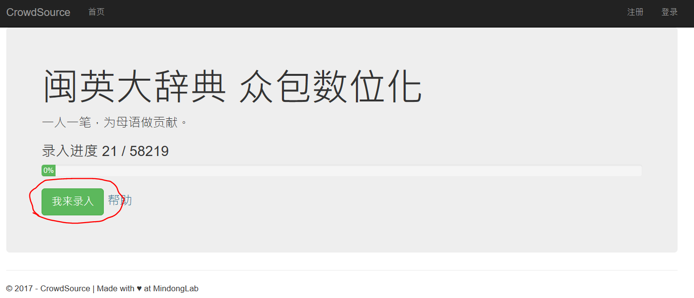

# 榕腔注音辞典 众包数位化 行动指南

<a class="btn btn-lg btn-success" href="http://cs.mindong.asia/">进入众包页面</a>

## 请加 QQ 群
* 福州话词典电子化 群： 442102439
* 闽东语实验室 群：519783603

## 榕腔注音辞典是什么？ 为什么要数位化？

榕腔注音辞典，英文原名 Alphabetic Dictionary of the Foochow Dialect, Third Edition, 1929。又译为《福州方言拼音字典》、《榕腔注音字典》。这是一部由传教士著成的闽东语福州话 - 英语 的对照词典。第一版写于1870年，此为第三版。全书近2000页收入了近6万个词汇。 将此辞典数位化，不仅会成为目前最大的福州话词典； 对闽语古今变迁的研究，也能提供宝贵的资料。

## 众包怎么做？

简单来说，我们把字典切成一个个条目。通过网友一起录入和校对，来完成这项浩大的数位化工程。

榕腔注音辞典的一页长这样：

你会看到的是我们剪出来的一个个条目,像这样：

## 基本操作

点击“我来录入”开始。

我们录入的原则是: **尊重原书，尽可能和原文一模一样。**

### 罗马字的录入

当你点击罗马字录入框时，一个虚拟键盘会出现，让你选择一些特殊字符。

### 汉字的录入

<a name="chinese">

录入汉字时，我们要如实输入传统汉字（繁体字）。

### 繁体字输入法

常见的输入法都有“繁体”模式:

*   **搜狗输入法:**在状态栏上面右键菜单里的【简->繁】选中即可进入到繁体中文状态。再点击一下即可返回到简体中文状态。
*   **QQ输入法:**右键点击状态栏，在菜单里选择“繁体模式”，即可以进行繁体切换。
*   **Win10/Win8自带拼音输入法:**右键状态栏上的【中】图标，打开设置，设置为繁体。

</a>

如果你想要更好的繁体字输入。我们推荐[RIME 输入法](http://rime.im/)。

### 疑难字怎么办？

遇到输入法打不出的汉字，你可以尝试以下方法：

1.  输入法自带的手写板功能。
2.  输入法的【部首组字】功能。如搜狗输入法的[“U模式”。](http://pinyin.sogou.com/help.php?list=3&q=8)
3.  用字海zisea.com的[两分查字](http://zisea.com/zslf.htm)功能。

    

4.  用[Glyphwiki](http://zhs.glyphwiki.org/wiki/GlyphWiki:首页)来查找异体字。以查“厦”的异体字为例。

    

    

5.  如果实在没办法，可以点“换一条”，或者到[QQ群](#qqgroup)求助。

<a name="pivot">

### 什么是“单字条目”？

</a>

榕腔注音辞典中，每当出现一个新汉字时，就会有一个特殊的词条（一行）。这种特殊行我们叫“单字条目”。

录入“单字条目”时，要把“偏旁”、“国语注音”填到不同的框里。像下面这样：

### 英文的录入

英文的录入没有太多特别的。要注意有的时候英文部分会带有福州话罗马字。

## 常见问题 FAQ

### 我需要注册、登录吗？

**不需要。**但是，如果你登录的话，我们会记录你的贡献量，并记入贡献者名单（当然你也可以选择做“匿名英雄”）。

### 遇到这种图片怎么办？

请点击图片不清楚报告错误。

### 图片上面有上一条的“残留”

这个**没关系**。只要不影响你当前这条的录入就好。

### 一会打汉字，一会打英文，我很乱啊，怎么办？

你**不需要**打完全部的“框框”。你可以只打一种类型的框，比如只打汉字、只打罗马字、或者只打英文。没有打完的部分，系统会自动交给别人来打。

### 打错了，提交了，怎么办？

没关系，之后还会有校对。